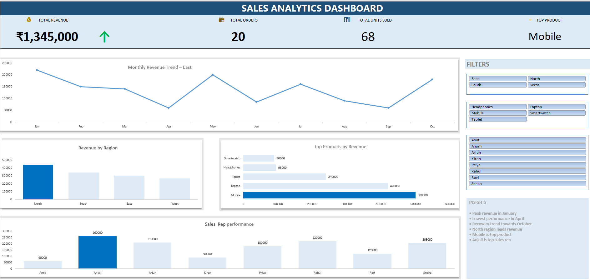

# 📊 Sales Analytics Dashboard (Excel)

## 📌 Project Overview

This project is an interactive Excel dashboard designed to analyze sales performance using KPIs, pivot tables, charts, and slicers.

## 🚀 Features

* KPI indicators for revenue, orders, and product performance
* Monthly revenue trend analysis
* Region-wise and product-wise comparison
* Sales representative performance tracking
* Interactive slicers for dynamic filtering
* Insight-driven dashboard design

## 🛠 Tools Used

* Microsoft Excel
* Pivot Tables
* Pivot Charts
* Conditional Formatting
* Slicers

## 📷 Dashboard Preview

## 📄 Files Included

* `dashboard.xlsx` → Fully interactive dashboard
* `dashboard.pdf` → Static export version
* `dashboard.png` → Dashboard preview

## 💡 Key Insights

* Highest revenue observed in January
* Significant drop in April
* Strong recovery trend towards October
* North region leads in sales
* Mobile is the top-performing product
* Anjali is the highest-performing sales representative

---

⭐ This project demonstrates data analysis, visualization, and dashboard design skills using Excel.

